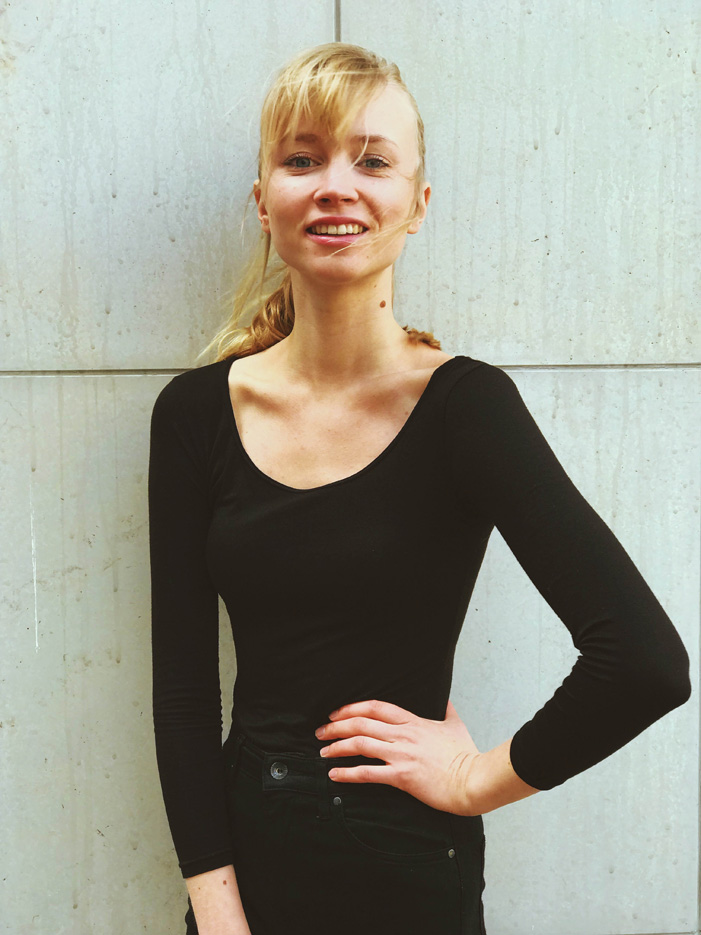

I am a Full Stack Developer Focusing on Javascript, React, Styled-Components, GatsbyJS, NextJS, React Native, NodeJS, ExpressJS, Postgres & MongoDB.

I am originally from a tiny country in Northern Europe, called [Estonia](https://en.wikipedia.org/wiki/Estonia), but moved to the United States after getting married to my wonderful husband, Brian.

After traveling the world as a fashion model until age 21, I went to [University of Tartu](https://www.ut.ee/en) to become a doctor just like my parents. It took me a while, but I understood that even though I find medicine fascinating, working as a doctor is not my true call. So I took the leap, left, and tried something else - I learned how to program. I was so intrigued, that I decided to do this professionally.

I love being in the tech field since it's fast paced, forever evolving nature with endless opportunites. I love that it is obtainable for anyone with a laptop and internet, and being able to build projects that can literally reach, and help, the whole world.

Now I can say, I am a developer that strives to write clean code, test driven development and enjoys solving problems. I'm often on [HackerRank](https://hackerrank.com/getterhiss) coding in my free time.

If not coding, I'm probably nerding out and relaxing with one of my favorite TV shows - Silicon Valley, Halt and Catch Fire, The Office and Seinfeld.

### You can also find me on..

♥️ [Twitter](https://twitter.com/getterhiss)
♥️ [LinkedIn](https://linkedin.com/in/getterhiss)
♥️ [GitHub](https://github.com/getterhiss)
♥️ [Stackoverflow](https://stackoverflow.com/cv/getterhiss)
♥️ [HackerRank](https://hackerrank.com/getterhiss)