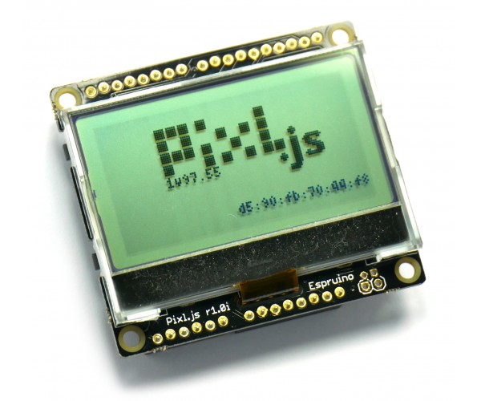
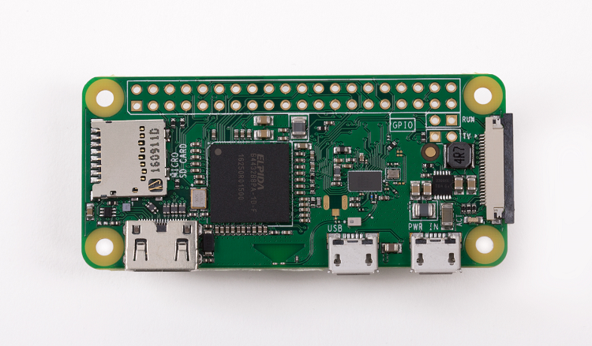
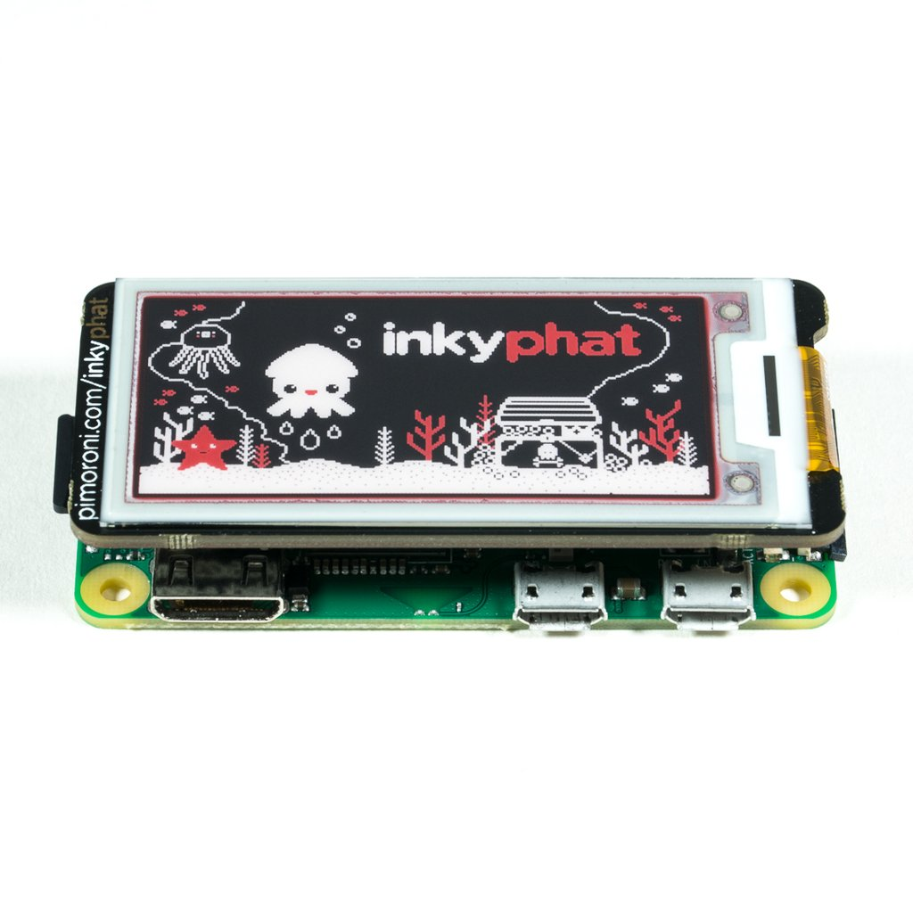

# So I'm getting a Raspberry Pi

This is so cool, what an exciting time. I can't wait to hack on it and do something cool!

## Two avenues
For one, since I am learning to program in Javascript, the obvious choice would be the [Espruino Pixl.js](https://shop.espruino.com/pixljs), which looks like a fun device.

It's an all in one Javascript microprocessor with a built in display. 

But I wanted a challenge, something that I could expand more at a later time. So I am opting for the [Raspberry Pi Zero W](https://www.raspberrypi.org/products/raspberry-pi-zero-w/). It comes with Wireless and Bluetooth built into a ~ $10 computer!

I plan on putting [Rasbian or Ubuntu Core](https://www.raspberrypi.org/downloads/) as the Operating System and then installing a NodeJS server for fun. Now I can run Javascript on a development server.

## Fun Stuff
I think it would be really fun to do something with a display, so I am looking at the [Inky pHAT](https://thepihut.com/products/inky-phat), an E-Ink colorful display I can hook right up to the Raspberry Pi Zero.

Keep you posted on what I come up with!